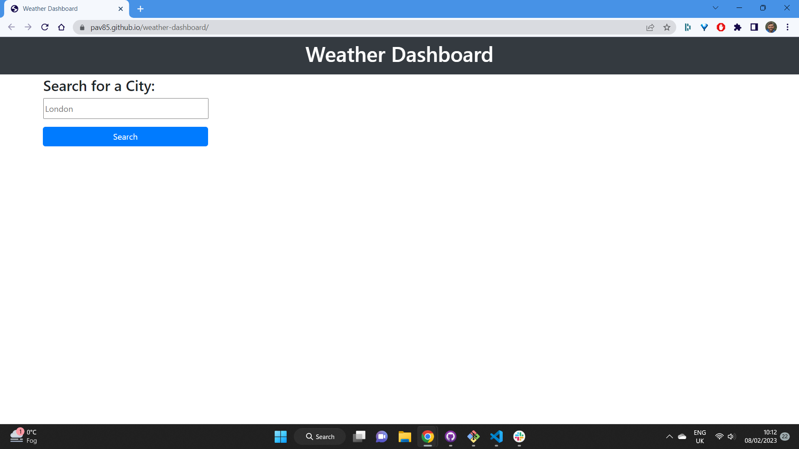
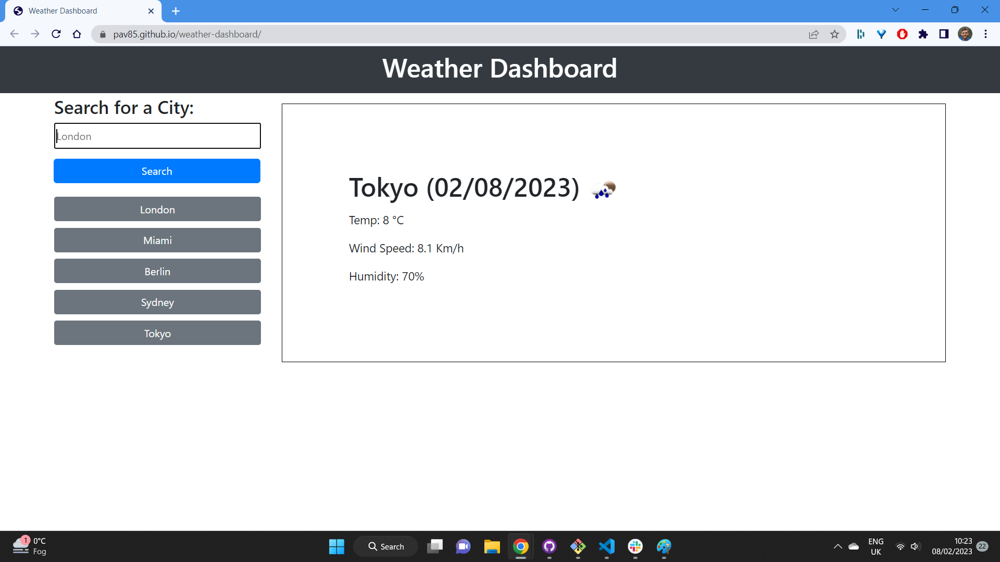

# Weather-dashboard

## Description

Weather Dashboard that displays weather information of city searched by user. Searched cities are saved in a button so user can easily go back to them and display weather information again.

## User Story

AS A traveler
I WANT to see the weather outlook for multiple cities
SO THAT I can plan a trip accordingly

## Installation

After opening this URL: https://pav85.github.io/weather-dashboard/ you should see this:

After few search inputs the page should look similar to this:

## Credits

N/A

## License

MIT License
