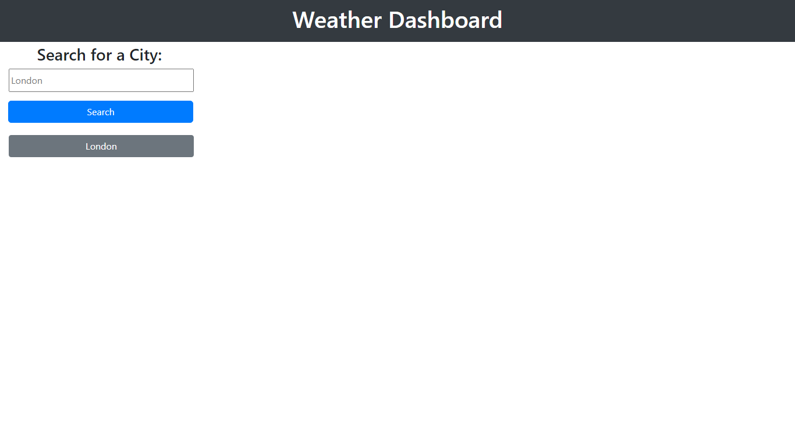

# Weather Dashboard

## Description

This Weather Application provides current weather information and a five-day forecast for cities around the world. It utilizes the OpenWeatherMap API to fetch weather data based on user input. The application also stores the history of searched cities (up to 10) in local storage for quick access.

## User Story

AS A traveler
I WANT to see the weather outlook for multiple cities
SO THAT I can plan a trip accordingly

## Features

- **Search Functionality**: Allows users to search for any city to get current weather and a five-day forecast.
- **Five-Day Forecast**: Displays temperature, humidity, and weather icons for the next five days.
- **Search History**: Saves the last 10 searched cities and allows users to quickly view the weather of these cities again.
- **Responsive Design**: Works on various devices and screen sizes.

## Setup

1. **Get the OpenWeatherMap API Key**:
   - Register at OpenWeatherMap.
   - Navigate to the API keys section and generate a new key.

2. **Include API Key in the Application**:
   - In the JavaScript file, locate the variable `APIkey`.
   - Assign your OpenWeatherMap API key to this variable.

3. **Load the Application**:
   - Open the HTML file in a web browser and you should see something like this:
  
  
## Usage

1. **Search for a City**:
   - Type the name of a city in the search input box.
   - Click the 'Search' button to display the weather.

2. **View Five-Day Forecast**:
   - The forecast below the current weather will automatically update with a five-day forecast.

3. **Access Search History**:
   - Click on any of the city buttons under the search history section to quickly access the weather for that city.

4. **City Search History**:
   - The application stores the last 10 searched cities in local storage.

## Contributions

Contributions, issues, and feature requests are welcome. Feel free to check [GitHub Repository](https://github.com/Pav85/weather-dashboard) if you want to contribute.

## License

This project is [MIT](https://opensource.org/licenses/MIT) licensed.
